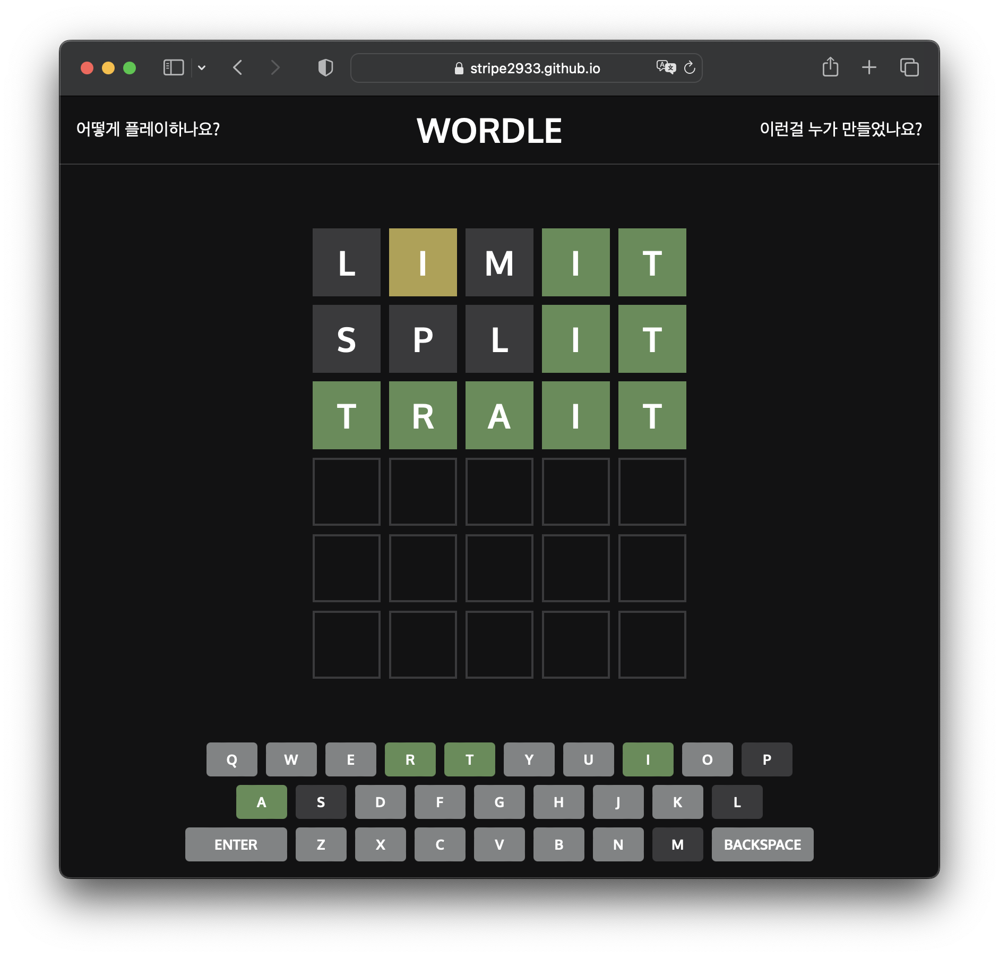

# 안녕하세요👋

저는 학생 프로그래머이고, 고성능 계산 시스템·컴퓨터 그래픽스·백엔드 개발을 좋아합니다.

🔭 저는 고려대학교에서 전기전자공학부와 컴퓨터학과를 이중전공하고 있습니다. 현재는 군입대를 위해 휴학중입니다.

🌱 최근에는 OpenGL과 Vulkan을 공부하는데 시간을 투자하고 있습니다. 처음에는 [SFML](https://github.com/SFML/SFML)로 그래픽 프로그래밍을 시작했으며, 해당 라이브러리는 구 버전의 OpenGL을 사용함에 따라 필요한 기능의 부재가 많아 (인스턴싱 등) 현재는 OpenGL을 주로 사용하는 중입니다. macOS에서 OpenGL을 deprecated함에 따라 버전이 4.1에서 멈췄기에, 최신 기능(compute shader 등)이 필요한 경우에는 Vulkan을 사용하기도 합니다. 다음은 제가 작성한 관련된 몇 가지 프로젝트입니다.

| 저장소 | 설명 |
|:-----:|:-----:|
   [icosphere](https://github.com/stripe2933/icosphere) | 구를 묘사하기 위해 icosphere (정20면체를 재귀적으로 분할하여 구로 근사하는 것)를 동적으로 분할하여 렌더링하며, flat shading, Phong shading을 지원합니다. Indexed drawing과 UBO를 도입하여 CPU-GPU간 데이터 전송 용량을 최소화했고, Dirty flag 패턴을 사용해 각 데이터 간 의존 관계를 명확히 하였습니다.    *개발 언어: C++, 프레임워크: OpenGL*
      [OpenGLApp](https://github.com/stripe2933/OpenGLApp/tree/main) | OpenGL의 boilerplate 코드를 줄이고, 코드를 객체지향화 할 목적으로 구현한 라이브러리입니다. 특히 컨텍스트 내 셰이더 전환에 의한 성능 하락 방지를 위해 `glUseProgram`을 직접 호출하는 대신 해당 작업을 큐에 쌓고 최종 draw call에 이를 실행하는 게으른 (lazy) 전략을 사용하여 성능을 향상하였습니다. 해당 라이브러리를 사용하는 [다양한 예제](https://github.com/stripe2933/OpenGLApp/tree/main/examples)를 첨부하였습니다.  *개발 언어: C++, 프레임워크: OpenGL*

🌱 저는 개발에 C++를 주력으로 사용하고 있으며, 필요에 따라 Rust, Python, C#을 사용하기도 합니다. 컴퓨터 그래픽스나 고성능 계산이 필요한 경우에 C++를 사용하며 최신 C++ 기능을 도입하여 표현력있고 이해하기 쉬운 코드를 작성하기를 지향합니다. Vulkan 또는 웹 서버를 구현하는 경우 Rust (각각 [vulkano](https://github.com/vulkano-rs/vulkano), [actix-web](https://github.com/actix/actix-web) 사용)를, 데이터 처리·분석은 Python을, 크로스 플랫폼 데스크톱 앱 개발에는 C#과 [Avalonia](https://github.com/AvaloniaUI/Avalonia)를 주로 사용합니다. 다음은 제가 작성한 해당 언어로 작성된 몇 가지 프로젝트입니다.

| 저장소 | 설명 |
|:-----:|:-----:|
   [Chat](https://github.com/stripe2933) | REST API로 구현된 로그인/회원가입 등의 기능과, Websocket을 사용한 실시간 채팅 기능을 제공합니다. 멀티스레딩과 비동기 데이터베이스 요청을 이용한 고성능 처리와, HTTP/2 TLS 연결을 사용하여 보안성을 염두에 두었습니다.    *프레임워크: Vue-Js 3 (프론트엔드), Actix-web (백엔드)*
[mdspan-formatter](https://github.com/stripe2933/mdspan_formatter) | C++23에 새로 도입된 `mdspan`과 `range_formatter`를 이용하여, 일반화된 layout (행 우선, 열 우선 등)의 다차원 배열을 NumPy와 유사하게 formatting할 수 있습니다. 템플릿 메타 프로그래밍을 이용해 컴파일 시간에 최적화된 코드를 생성합니다. Boost.ut를 사용해 단위 테스트 되었습니다.    *개발 언어: C++*
   [SeoulMetropolitanSubway](https://github.com/stripe2933/SeoulMetropolitanSubway) | [서울교통공사](http://www.seoulmetro.co.kr/kr/cyberStation.do)의 데이터를 Selenium으로 크롤링하고, 이를 NetworkX로 그래프화합니다. 카카오 로컬 API를 이용하여 추출한 역명의 경위도를 바탕으로 Matplotlib로 도시합니다. 2019년 대전광역시 수학동아리 컨퍼런스를 참가하며 만든 프로젝트입니다.    *개발 언어: Python, 라이브러리: Selenium, Matplotlib*
   [Todo.Avalonia](https://github.com/stripe2933/Todo.Avalonia) | Avalonia를 이용해 만든 간단한 ToDo 애플리케이션입니다. Light/Dark 모드를 지원하며 SQLite를 이용해 입력 데이터를 저장하고 실행 시 로드 가능합니다.   *개발 언어: C#, 프레임워크: Avalonia*
   [wordle](https://github.com/stripe2933/wordle) | 팬데믹 당시 유행하던 wordle 게임을 Vue-js를 이용해 정적 구현하였습니다.    *개발 언어: Javascript, 프레임워크: Vue-js*

🌱 또한 수학적 원리나 알고리즘을 프로그램으로 구현하는 것을 좋아합니다. 다음은 이와 관련된 제가 작성한 몇 가지 프로젝트입니다.

| 저장소 | 설명 |
|:-----:|:-----:|
   [NBody](https://github.com/stripe2933/NBody) (시각화 프로그램) [NBodyExecutor](https://github.com/stripe2933/NBodyExecutor) (알고리즘 구현체) | 3D 다체 문제를 시뮬레이션하는 프로그램으로, 기존 brute-force 알고리즘의 $O(n^2)$ 시간복잡도에서 8진 공간 분할 트리(octtree)를 이용해 $O(n \log n)$으로 개선한 [Barnes-Hut 알고리즘](https://en.wikipedia.org/wiki/Barnes–Hut_simulation)을 사용하였으며, 멀티스레딩을 이용하여 M1 Pro 기준 최대 100,000개까지 실시간으로 계산 가능합니다. ImGui UI를 도입하여 동적 시뮬레이션 생성/삭제/파라미터 수정이 가능합니다.  *개발 언어: C++, 프레임워크: OpenGL*
   [EllipseCollision](https://github.com/stripe2933/EllipseCollision) | 2D 물리엔진에서 두 강체의 충돌을 판정하기 위해 개발하였으며, 임의의 Affine 변환된 두 타원체의 이차 형식(quadratic form)을 스칼라 값으로 변환하는 볼록 함수를 만들고, 이를 경사 하강(gradient descent)하여 겹침을 판정합니다. 2023년 볼록최적화입문 과목을 수강하며 만든 프로젝트입니다.    *개발 언어: C++, 프레임워크: SFML, 라이브러리: Eigen3*
   [FourierEpicycles](https://github.com/stripe2933/FourierEpicycles) | 이산 푸리에 변환을 사용하여 주어진 복소 샘플을 매끄럽게 연결하는 등속 주전원(epicycle)으로 신호를 표현합니다. File Dialog를 사용하여 복소 샘플을 선택할 수 있으며, [ImGui](https://github.com/ocornut/imgui)를 도입하여 간단한 마우스 조작/정보 표시가 가능합니다. 2023년 신호와 시스템을 수강하며 만든 프로젝트입니다.    *개발 언어: C++, 프레임워크: SFML, 라이브러리: FFTW*

---

#### 📫 Contact
- Email: stripe2933@outlook.com
- [Velog](https://velog.io/@stripe2933)

<!--
**stripe2933/stripe2933** is a ✨ _special_ ✨ repository because its `README.md` (this file) appears on your GitHub profile.

Here are some ideas to get you started:

- 🔭 I’m currently working on ...
- 🌱 I’m currently learning ...
- 👯 I’m looking to collaborate on ...
- 🤔 I’m looking for help with ...
- 💬 Ask me about ...
- 📫 How to reach me: ...
- 😄 Pronouns: ...
- ⚡ Fun fact: ...
-->
